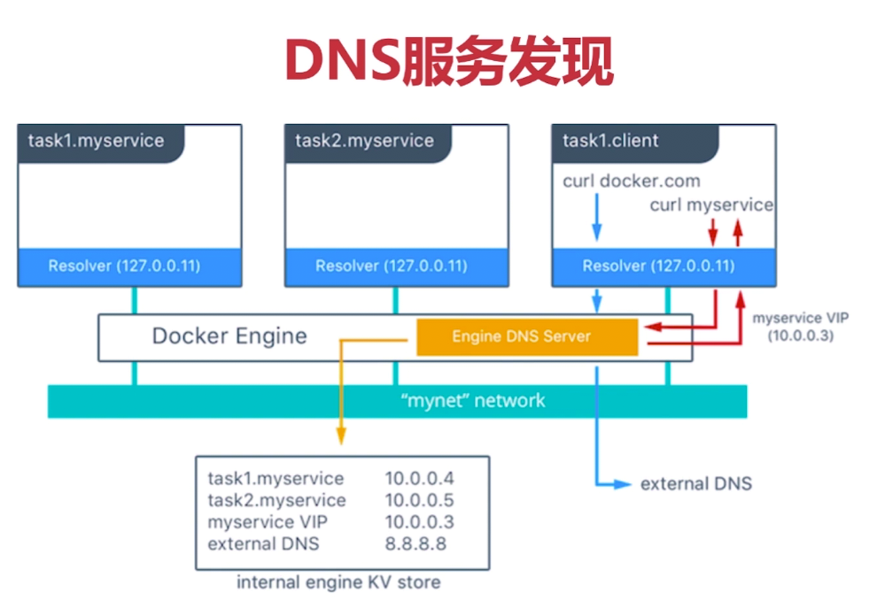

# Docker 学习笔记05

## 1. 容器编排 

通过 vagrant 创建3台机器，参考 Vagrantfile 配置文件

```
$ docker swarm init --advertise-addr=192.168.205.10
```

根据提示在 worker 中运行 `docker swarm join xxxxxx`

```
$ docker node ls
```

此时执行 scale，会分配到各个节点上

## 2. 通过 swarm 部署 wordpress

通过swarm操作集群，服务部署到哪个节点上由swarm自动分配。

在上一步三个节点的基础上，首先需要创建名为 demo 的 overlay 网络，使得不同的机器上的容器可以互相访问

```
$ docker network create -d overlay demo
$ docker network ls
```

创建service，类似container

```
$ docker service create --name mysql --env MYSQL_ROOT_PASSWORD=root --env MYSQL_DATABASE=wordpress --network demo --mount type=volume,source=mysql-data,destination=/var/lib/mysql mysql
$ docker service ls
$ docker service ps mysql
$ docker ps

$ docker service create --name wordpress -p 80:80 --env WORDPRESS_DB_PASSWORD=root --env WORDPRESS_DB_HOST=mysql --network demo wordpress
$ docker service ps wordpress
```

例如wordpress服务安装到了 swarm-worker2 上，但是随意访问三个节点的 IP 地址都能访问，swarm-manager、swarm-worker1。

## 3. 集群服务间通信之 Routing Mesh



首先确保有 overlay 网络。

```
$ docker network create -d overlay demo
```

创建 service，使用名为 whoami 的 image

```
$ docker service create --name whoami -p 8000:8000 --network demo -d jwilder/whoami
$ docker service ls
$ docker service ps whoami
```

横向扩展

```
$ docker service scale whoami=2
```

**Routing Mesh 的两种体现**

+ Internal —— Container 之间通过 overlay 网络，使用 vip 虚拟ip访问
+ Ingress —— 如果服务有绑定接口，则此服务可以通过任意 swarm 节点的相应接口访问

## 4. Docker Stack 部署 wordpress

在 swarm 中使用 compose 部署，需要使用 Docker Stack，yml 参考 `05/01-wordpress/`

## 5. Docker Stack 部署投票应用

network 在 docker compose 下默认为 overlay

其中的 visualizer service 为可视化工具

```
$ docker stack deploy example --compose-file=docker-compose.yml
```

## 6. Docker Secret 密码管理

管理 compose 中的密码

通过文件创建

```
$ docker secret create
$ vim password
$ docker secret create my-pw password
$ rm -rf password
$ docker secret ls
```

通过命令行创建

```
$ echo "adminadmin" | docker secret create my-pw2 -
$ docker secret ls
```

删除

```
$ docker secret rm my-pw2
$ docker secret ls
```

使用

```
$ docker service create --name client --secret my-pw busybox
# 查看密码
$ docker exec -it acsdv2d sh
> cd /run/secrets/
> ls
```

## 7. service 更新

首先确保有 overlay 网络。

```
$ docker network create -d overlay demo
```

创建 service

```
$ docker service create --name web --publish 8080:5000 --network demo xxx/python-flask-demo:1.0
$ docker service ps web
```

横向扩展

```
$ docker service scale web=2
$ docker service ps web
```

更新image，逐个更新而不中断业务

```
$ docker service update --image xxx/python-flask-demo:2.0 web
```

更新端口，业务需要中断

```
$ docker service update --publish-rm 8080:5000 --publish-add 8088:5000 web
```

