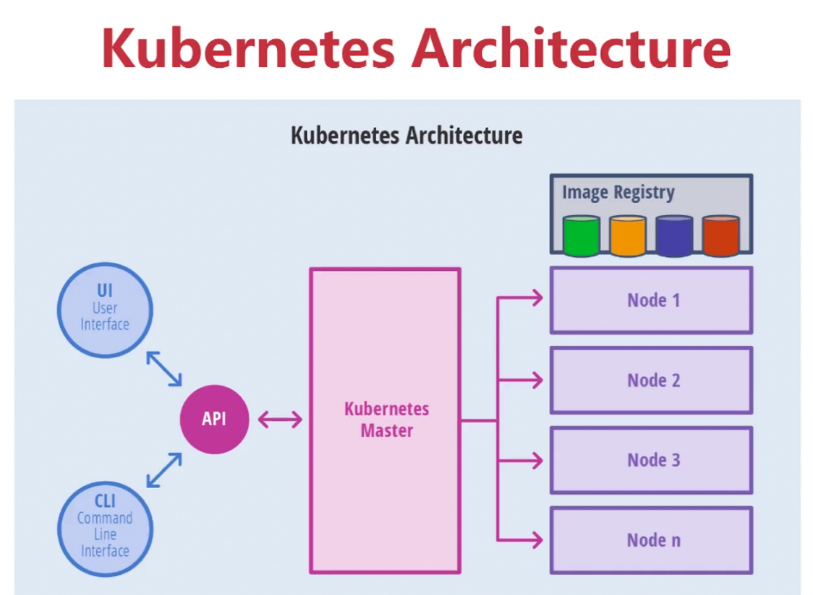
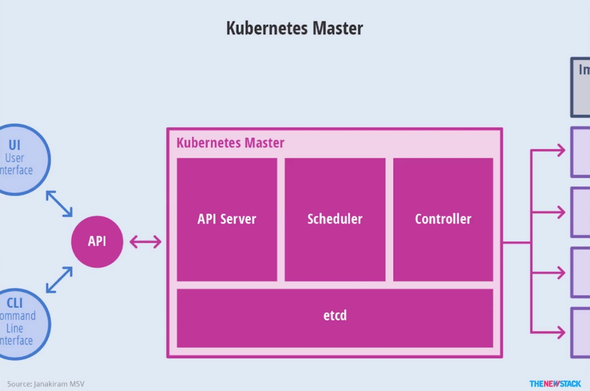
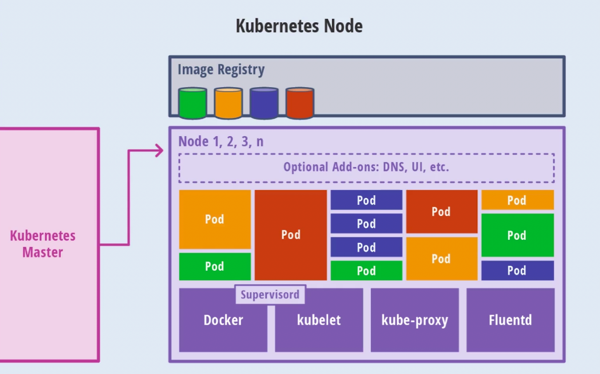

# Docker 学习笔记06

## 1. kubernetes 







## 2. k8s环境安装

Minikube 用于本地单节点开发测试

kubeadm 稍复杂，用于部署多节点

mac 安装 minikube，[](https://minikube.sigs.k8s.io/docs/)

```
$ minikube start
$ minikube status
$ minikube ssh
$ docker ps
```

安装 kubectl，用于和 k8s 集群交互

```
$ mv kubectl /usr/local/bin
```

